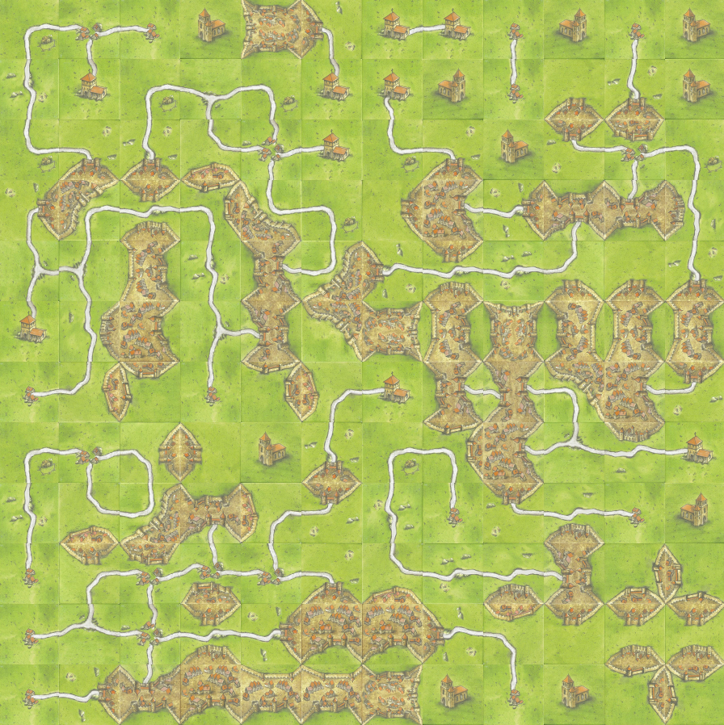

# cartassonne
\
 \
A Carcassonne game tiler that will make random Carcassonne games for hanging on your walls.
## Installation and Use
Clone the repository:\
`git clone https://github.com/perspector/cartassonne.git`

Install Python:
On Debian/Ubuntu and derivatives:\
`sudo apt-get install python3 python3-venv`

Make and activate a new Virtual Environment:
```
python3 -m venv cartassonne
source cartassonne/bin/activate
```

Go to the directory you cloned this repository to:\
`cd cartassonne`

Install the required dependencies:\
`pip install -r requirements.txt`

Run the Python file:\
`python3 cartassonne.py`

## Credits
* Thank you tsaglam for the wonderful Carcassonne tiles\
  See https://github.com/tsaglam/Carcassonne
* Pillow for image concatonation
* Python for a wonderful programming language
* Hans im Glück for the fantastic game of Carcassonne
